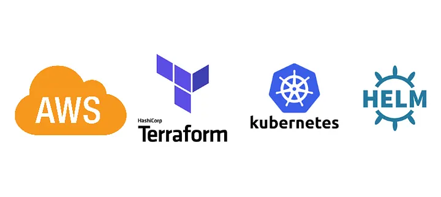

<h2> Hello, and welcome!</h2>

 
 

### Who I am

A passionate Lead Platform Engineer working on cloud infrastructure, serverless technologies, kubernetes, and helping organisations create secure and scalable infrastructure, GitOps and DevOps environment.

### What I do

GoLang, Python, Terraform, Serverless, Kubernetes, and all those platform level engineering

<!-- Just a hack for a thin line  -->
##

